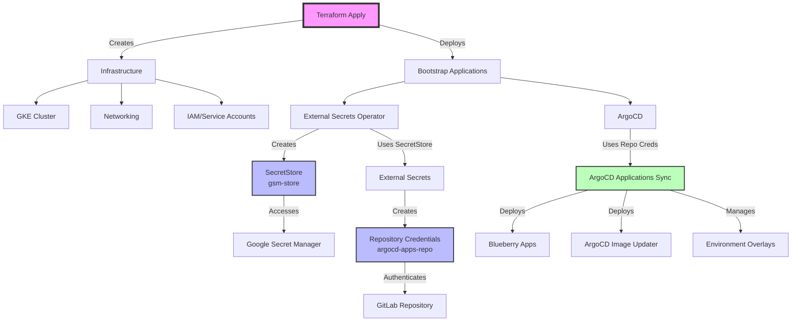

# GitOps Bootstrap Flow

This document describes the proper GitOps approach for bootstrapping the Blueberry platform infrastructure and applications.

## Overview

The bootstrap process follows a specific sequence where Terraform handles infrastructure and initial setup, then ArgoCD takes over for application management via GitOps.

## Flow Diagram



## Step-by-Step Process

### 1. Terraform Apply
- **Source**: `blueberry/blueberry-terraform`
- **Creates**: 
  - GKE cluster infrastructure
  - Networking components
  - IAM roles and service accounts
  - Initial bootstrap applications

### 2. Bootstrap Applications
Terraform deploys the foundational applications:
- **External Secrets Operator**: For secrets management
- **ArgoCD**: For GitOps-based deployments

### 3. SecretStore Creation
- **Created by**: Terraform/Bootstrap process
- **Name**: `gsm-store`
- **Purpose**: Connects External Secrets to Google Secret Manager

### 4. External Secrets Setup
- **Depends on**: SecretStore existence
- **Creates**: Kubernetes secrets from external sources
- **Key secret**: `argocd-apps-repo` (GitLab repository credentials)

### 5. Repository Authentication
- **Secret**: `argocd-apps-repo`
- **Contains**: GitLab credentials for repository access
- **Used by**: ArgoCD to access the GitOps repository

### 6. ArgoCD Applications Sync
- **Depends on**: Repository credentials
- **Manages**: All application deployments via GitOps
- **Includes**:
  - Blueberry applications
  - ArgoCD Image Updater
  - Environment-specific overlays (dev, staging, prod)

## Common Issues and Resolution

### Missing Applications in ArgoCD
**Cause**: Bootstrap process incomplete
**Resolution**: Ensure Terraform apply completes successfully

### Sync Failures
**Cause**: Missing repository credentials
**Resolution**: Verify `gsm-store` SecretStore and `argocd-apps-repo` secret exist

### External Secrets Not Working
**Cause**: SecretStore not properly configured
**Resolution**: Check Terraform outputs and Google Secret Manager permissions

## Key Dependencies

1. **Terraform must complete** before any GitOps operations
2. **SecretStore must exist** before External Secrets can function
3. **Repository credentials must be created** before ArgoCD can sync applications
4. **All bootstrap components must be healthy** before application deployment

## Verification Steps

```bash
# Check if SecretStore exists
kubectl get secretstore gsm-store -n external-secrets

# Verify repository secret
kubectl get secret argocd-apps-repo -n argocd

# Check ArgoCD application status
kubectl get applications -n argocd
```